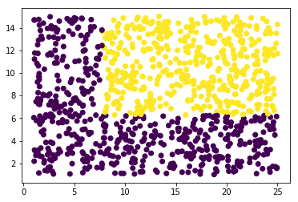

link to this notebook in nbviewer: [Intro to Neural Nets: 50 Steps](https://nbviewer.jupyter.org/github/Asrst/udacity-pytorch-intro-to-neural-nets-notes/blob/master/01_Intro%20Neural%20Nets%20with%20Numpy.ipynb)


```python
# !git clone https://github.com/udacity/deep-learning-v2-pytorch.git
```

    Cloning into 'deep-learning-v2-pytorch'...
    remote: Enumerating objects: 708, done.
    remote: Total 708 (delta 0), reused 0 (delta 0), pack-reused 708
    Receiving objects: 100% (708/708), 125.92 MiB | 4.93 MiB/s, done.
    Resolving deltas: 100% (243/243), done.


##### Load the modules


```python
import numpy as np
import os
import matplotlib.pyplot as plt
import seaborn as sns
```


```python
path = os.getcwd()
```

### 01.Introduction

Neural Nets are designed to mimic the process of how the neurons work in our brain(to some extent), and they are 
becomig popular these days. Thats because, In recent research they achieved some state of art results in several applications such 
as self-driving cars, playing atari games, identifying the patterns, and many other work which needs human intelligence.
Slowly they became the heart of artifical intelligence and now many applications ae revolving around them. 
Now lets get into what they look like and how they work.

Assume a small child trying to separate set of two different stones in sand without moving them. how he will proceed? 
He will make a line in between them to separate them, right? But what if a straight line doesn't his case? he will try to make a curve may be a circular, parabolic, elliptical, etc...Thats what neural networks do in very high level. 

Looking at figures of neural networks can be intimidating at the begining, but once you ae into them, they will be interesting and looks easier. Just Relate this way: Type of stones as classes we are trying to separate and properties of stones as features.Now given the features Neural Networks will do the thinking part for you with computional power.

Why are neural nets often called deep neural networks? In General, each neuron has opertaional unit called perceptron and these perceptrons are arranged in form of tens of layers and each layer containg several hundreds of perceptrons. As these layers are deep and long, these are called deep neural nets and they are require high computioanl power too. Hence the name deep learing, a subset of machine learning.

### 02 & 03.Classification Problem 

Now lets work with simple classification problem to decide whether a given student gets admitted into university or not, given
two features - previous grade and entrance test score.


from the image it is clear that, it can be done easily with line separting the two classes - which can correctly prediction the classification in 90% of the cases. There are very few mis-classification but still a good case to slove using a simple staright line. Here, we are generalizing the data and finding a straight line which can sepaarte them. Now, the real question is how to find that line which can separate the classes for the given data points as shown in the figure.

### 04.Linear Boundaries:

The line which can separate the given classes is generally called a separation boundary. If it is straight line then it will be a linear boundary, if not it will be non-linear boundary.

Lets only consider a linear boundary for now: A straight line separating two classes.To find eqauation of the line, we need its coefficients: `y = w1x1 + w2x2 + b` where `w1`, `w2` are co-efficients and `b` is the intercept. 

** what is the significance of Bias Term(b) ? **

Lets us assume there is no intercept term, it represents that the line we are looking to separate the classes passes through the 
origin. But it won't alwayas pass through the origin. Just imagine in the above case, can we separate the two classes with a line passing through origin? No, there will be lot of overlapping, accuracy will be down, and model will fail to generalize 

So instead of taking the bias (intercept) as '0'/consatnt we are considering it as variable similar to co-efficients and we are leaving to nueral network to calculate suitable co-efficients and intercept of the suitable line.

for a general equation of `y = w1x1 + w2x2 + b`

So we are using the neural networks to find that best weights and bias which in turn can give us the best fit line that cab separate various classes.Our data points provides the values for y, x1, x2 and we are using neural nets to find the variables.


**Machine Learning Jargon:**

* y = target.
* x1, x2 = features.
* w1,w2,b = variables - (changes frequently with added data points).
* co-efficinets of features(w1, w2, w3....wn) = weights.
* co-efficient of intercept (=1) * intercept = bias (b).
* best fit line = regression or separation boundary.

### 05. Higher dimension

Now instead of two features, let say we having 'n' features then neural network need to calculate the 'n' corresponding weights.
and a bias(b)

The linear equation modifies to ` y = w1x1 + w2x2 + w3x3 + .....WnXn + b`

With increase in the no.of features dimensionality also increases and the problem
becomes more complex. starting from 3-dimesions, we need a 'plane' that can separate the data points (its no longer a line).
For 'n dimesional' classification we need to find the 'n-1' dimesional plane. Visually we can only see up to 3-dimension, but
there are advanced techniques like PCA and TSNE which will be bring down this complexity. 

Ex: for a classification using 3 features it will be a 2D plane.

    

### 06.Perceptrons:

If familiar with Machine Learning already, Consider logistic regression which works in same way and separates the data using a line. Each perceptron in a 
neural network is equivalent to one logistic regression in functionality. But there are more things which neural network do with perceptrons and we will discuss it simultaneosuly.

### 07. Why Neural Networks?

So we can use Logistic Regression for Classification, then why neural networks? By this time, You might already guesing that because neural networks perform better. Thats true to some extent, but not always - Neural Nets perform better when used with right architecture(building a high performing neural network architecture is more of a research topic). Also, Neural Networks need large amount of data to show their performance, typically hundreds/thousands of features and thousands/lakhs of data points. 

One important reason is, they can take complex inputs like images, sequences(text) and can identify features in them. Also they can  perserve the spatial structures in case of images and remember sequences in case of text. We will learn these later(CNN & RNN), for now lets get back and clearly learn the basics.

### 08. Perceptrons as Logical Operators

**For AND operator:**


| Input  | Input | Output | 
| ------ | ------| -------| 
| 1      | 1     | True   | 
| 1      | 0     | False  | 
| 0      | 1     | False  | 
| 0      | 0     | False  | 

-------

substitute the Input values in the line equation w1x +w2x + b < 0 for -ve classification and > 0 for +ve classification

why < 0 & > 0 ? : In the x-y plane, we consider -ve region as `False` and +ve region as `True`

1. ` b < 0  `                            # let b = -1
2. ` w2 + b < 0  i.e. w2 < -b  `         # w2 = 0.5
3. ` w1 + b < 0  i.e. w1 < -b  `         # w2 = 0.7
4. ` w1 + w2 + b >= 0   `


```python
import pandas as pd

# TODO: Set weight1, weight2, and bias
weight1 = 0.5
weight2 = 1.5
bias = -2.0


# DON'T CHANGE ANYTHING BELOW
# Inputs and outputs
test_inputs = [(0, 0), (0, 1), (1, 0), (1, 1)]
correct_outputs = [False, False, False, True]
outputs = []

# Generate and check output
for test_input, correct_output in zip(test_inputs, correct_outputs):
    linear_combination = weight1 * test_input[0] + weight2 * test_input[1] + bias
    output = int(linear_combination >= 0)
    is_correct_string = 'Yes' if output == correct_output else 'No'
    outputs.append([test_input[0], test_input[1], linear_combination, output, is_correct_string])

# Print output
num_wrong = len([output[4] for output in outputs if output[4] == 'No'])
output_frame = pd.DataFrame(outputs, columns=['Input 1', '  Input 2', '  Linear Combination', '  Activation Output', '  
                                              Is Correct'])
if not num_wrong:
    print('Nice!  You got it all correct.\n')
else:
    print('You got {} wrong.  Keep trying!\n'.format(num_wrong))
print(output_frame.to_string(index=False))
```

    Nice!  You got it all correct.
    
    Input 1    Input 2    Linear Combination    Activation Output   Is Correct
          0          0                  -2.0                    0          Yes
          0          1                  -0.5                    0          Yes
          1          0                  -1.5                    0          Yes
          1          1                   0.0                    1          Yes


**Change from AND to OR:**
______________________________________________________________

**For OR perceptron:**

| Input  | Input | Output | 
| ------ | ------| -------| 
| 1      | 1     | True   | 
| 1      | 0     | True   | 
| 0      | 1     | True   | 
| 0      | 0     | False  | 


**Mathematically:**
    
To shift the line from down,it should come closer to origin, then distance from origin to line will decrease. 
Mathematically distance is `|b|/(w1+w2)^1/2`. For line to come close, this function shoud be reduced. hence bias `b` should be reduced in mangnitude and the weights `w1, w2`should be increased.

**Intutively:**

For given line slope will be `w2/w1` and intercept will be b/w1. If we move the line down the 
length of b/w1 reduces - i.e that happens when `b` reduces and `w1` increases. But increase in `w1` also changes the slope, so to neutralize this affect `w2` should also be increased.


** NOT Operator **

| Input  | Output | 
| ------ | -------| 
| 1      | False  | 
| 0      | True   | 

consider other input as `0` and it is not significant for claculating output, just a dummy input.

Substitute the inputs in the linear equation and they tranforms as follows

1. w2 + b < 0  
2. b > 0 

Now the change the one of the weights and bias accordingly.

** XOR Operator **

Truth Table:

| Input  | Input | Output | 
| ------ | ------| -------| 
| 1      | 1     | False  | 
| 1      | 0     | True   | 
| 0      | 1     | True   | 
| 0      | 0     | False  | 


It is the combination of NOT(AND) + OR = XOR

### 09. Perceptron Trick:

* To move the separation boundary closer to a point, we subtract that data point values from the co-efficients and the new line eqauation we get lies closer to that point and it becomes our new separation boundary.

* To move the separation boundary away from a point, we add the data points values to the co-efficients and the new line eqauation we get lies away from that point and it becomes our new separation boundary. 

This is a iterative process, untill all the data points are classified. The perceprtron algorithm with help of gradient descent will decides whether to move closer/away from the particular data point.

- [desmos](www.desmos.com) - Tool to Visualize the Graphs

### 10. Perceptron Algorithm:

1. Start with some random weights (w1, w2,....wn, b)


2. For Every data point with coordinates (p,q) & original label y:
   
   - perceprtron gives a new prediction `y_hat`, given by the equation $$ \hat{y} = step(w_1x_1 + w_2x_2 + b)$$
   

3. For Every point in dataset:

   If the point is correctly classified:
   - do nothing.
   
   Else If Point is miscalssified:
   -  If the point is classified positive, but it is orginally negative, subtract weights.
   - If the point is classified negative, but it is orginally positive, add weights.
   

4. Repeat until the Error becomes small


** Why Step Function?**

Step function here is defined as follows:

\begin{equation}
  \hat{y} = step(w_1x_1 + w_2x_2 + b) = 
    \begin{cases}
      0 & \text{if value < 0}\\
      1 & \text{if value > 0}\\
    \end{cases}       
\end{equation}


We get varied outputs, To bring them a common platform we are using this function. This Function takes any output value and squishes it to either 0 or 1.

### 11. Non Linear Regions:


```python
np.random.seed(52)
grades = np.random.uniform(1,25,1000)
scores = np.random.uniform(1,15,1000)

labels = []
for i in range(0,1000):
    if grades[i] >= 7.75 and scores[i] >= 6.25:labels.append(1)
    else: labels.append(0)
        
plt.scatter(grades, scores, c= labels)
```


    <matplotlib.collections.PathCollection at 0x7f3bd863ce48>





Till now we considered examples of data points which can are easily separable with a linear separation boundary(a line). 
Now imagine data-points as shown above, still a line separate them ? No, but may be a circle? curve? a polygon?, these comes under the Non-linear boundaries. 

A simple/single perceptron can't generalize these of boundaries for all datapoints, so we ask different no.of pereceptrons to generalize the boudary. When these no.of preceptrons are connected in different layers it becomes a neural network. Now lets look all other things to implement a perceptron and then we will move into building a simple nueral network of multilayer preceptrons. 

### 12. Error Functions

Error function is the function we are trying to reduce, why? because reducing it reduces the clasification error & classify the points correctly, but how? 

For now, keep reasons aside and Just believe. we will discuss this how factor in the coming lesson (discussed in - 18.Maximizing Probabilities) 

### 13. Log-loss Error function

One Important property of Error function is that it should be Continous as we need to differeniate it to update gradient descent. For Constant functions gradient is zero and updating weights is not possible. One such Error function is LogLoss.

`LL = -log(P), P is probablity of point belongs to its Original Class and it lies in b/w (0,1)`

### 14. Discrete v/s Continous Predictions

**The transition from step to sigmoid activation function:**

It now, we need used step function to calculate `y_hat` value, now we will another similar function 'sigmoid' and will comapre both

\begin{equation*}
Sigmoid = 1/(1+\mathrm{e}^{-x}) 
\end{equation*}

If we use the step function for our predictions, it gives the discrete ouputs either `0 or 1`. There is no certainity included, and cannot judge or comapre b/w different models if it is doing right or wrong.

sigmoid(x) is continous function and ranges between `[0,1]`. So, if sigmoid function is used, it gives values any where between 0 and 1. The values greater than 0.5 fall under positive region with final output 1 and values less than 0.5 fall into negative region of ouput 0. It gives us how closer the model is able to predict comapred to original prediction. 


Ex: 
1. If sigmoid predicts a value of 0.8, model says with 80% probability that points fall into positive region and with 20% it falls into negative region.

2. Similarly, If sigmoid predicts a value of 0.4, model predicts a 40% probanility for positive region and with 60% for negative region.

### 15. Softmax: for multi-class classification

\begin{equation*}
Softmax = \mathrm{e}^{x_{a}}/(\sum_{a=1}^{n}\mathrm{e}^{x_{a}}) = \mathrm{e}^{x_{1}}/(\mathrm{e}^{x_{1}} + \mathrm{e}^{x_{2}} + \mathrm{e}^{x_{3}}) 
\end{equation*}

Softmax is just a scaled version of sigmoid fuction for multi-class when no.of classes > 2. For n = 2, Softmax = Sigmoid

for n=3, softmax gives three probability outputs, say (0.2, 0.5, 0.3): It belongs to 2nd class as it is having highest probability of 0.5

**Note:** For n = 2 Softmax gives two outuput probabilities, say (0.4 and 0.6) for (0, 1) respectively. But sigmoid only gives one probability of prediction being 1 i.e. `P[X==1] = 0.6` and other probability is calculated as `P[X==0] = 1-P[X==1] = 1-0.6 = 0.4`


```python
sigmoid_x1 = 1/(1+np.exp(-1))
sigmoid_x0 = 1 - sigmoid_x1
print(sigmoid_x0, sigmoid_x1)
```

    0.2689414213699951 0.7310585786300049


```python
softmax_x1 = np.exp(1)/(np.exp(0)+np.exp(1))
softmax_x0 = np.exp(0)/(np.exp(0)+np.exp(1))
print(softmax_x0, softmax_x1)
```

    0.2689414213699951 0.7310585786300049


```python
#IMPLEMENTATION OF SOFTMAX:

# Write a function that takes as input a list of numbers(probablities), and returns
# the list of values given by the softmax function.
def softmax(L):
    eL = np.exp(L)
    s = sum(eL)
    return np.divide(eL,s)

# Alternate way: you can iterate over each element of list: np.divide does the same. 
# But it is always best to keep the use of loops to minimim as they are memory and time intensive.
```

**what is the need for an activation function like sigmoid/softmax function in Neural Networks? **

If we do not use a Activation function then the output will be a simple linear function. A Neural Network with no Activation function is a simple Linear regression Model, which has does not performs good in case of classifications. As the linear function is just a polynomial of one degree, they are limited in their complexity wont be able to gneralize the Non-linear data well. The data can be very complicated in case of images, videos , audio , speech etc and linear functions wont work for them.  

Neural-Networks are considered Universal Function Approximators, meaning that they can represents almost any process we can think of as a computational function. So we need more complex functions than simple Linear functions. All this arises is need for Non-linear functions, which have degree more than one and a curvature when plotted.

Hence it all comes down to this, we an Activation function f(x) that can represent non-linear & complex functional mappings from inputs to outputs. Other important property is, it needs to be differentiable to apply back-propagation.

### 16. One-hot Encoding:

If are having only 2 classes - we represent with 0 & 1 as their respective class. for more than 2 classes, one-hot encoding comes in, a similar way of representation using 0's and 1's.

for 3 classes, we represent this in following way, it also applies to all 2+ classes:

| True Label| is_cat | is_dog | is_tiger |
| ------| ------ | -------| -------  |
| cat  | 1 | 0 | 0 |
| dog  | 0 | 1 | 0 |
| tiger| 0 | 0 | 1 |

One Hot Encoding of 3 classes requires 3 columns, Lets suppose we are having n different classes (1 to n) and the given example belongs to 2nd class, then it is represented as `0,1,0,0,0,0,....up to n terms`(i.e it requires `n columns`). The column of the class it belongs is labeled with 1 and all remaining columns with 0's

### 17. Maximum Likelihood

The every data point in the dataset we are dealing is independent, so the likelihood in this case will be equal to product of the probability estimates of all datapoints.
- just remind that we get the probabilities from a exponentional function (sigmoid/softmax) & they lie b/w 0 & 1.

Multiplying the probability estimates  of all data points gives the `P(all)` Likelihood of the particular model being correct, but how this helps?

When we start training on the data, the network starts with a bad model and calculate its `P(all)`. For bad model this will be very low and networks tries to maximize this `P(all)` with different linear combination of perceptrons and finds a better model. The newtork iterates this process improving the model everytime, from bad to good, good to better, better to best. 

For the best model the value of `P(all)` will be highest, indicating that how accurate the particular model is comapred to other/previous models. So the best model is model with Maximum Likelihood and we want to maximize it. 

### 18. Maximizing Probabilities

The network tries maximizes its `P(all)` value, but how? If you the get the connections right, `P(all)` is maximum when the probability of each datapoint in the their respective class is maximum and this happens when the Error is minimum. So all this operations finally narrow down to minimizing the Error function by finding its gradient and updating the weights.

But there is something more we need to consider than finding the `P(all)`. The multiplication operation in finding `P(all)` results in the total probability values very less than 1 (sometimes ~0). This may results in the vanishing of gradient while finding derivatives, causing weights to disapper as `P(all)` tend towards zero.

So we need a function, we can change these products to 'sum', which can function can do that? Obviously `log`. So instead of multiplying, we take logarithm of products of probablities ~ equivalent to sum. (refer `log` properties). 

This operation increases the value of probablities so that they don't vanish and called maximizing the probabilities.

### 19 & 20. Cross Entropy:

Commnonly refered as Binary Cross Entropy as it is applicable to only 2 classes - 0 and 1.

CE is the average error for a data points, Hence we sum Errors of all the data points and divide it with no.of observations(data points), but wait how we arrived at this generalized formula? 

\begin{equation*}
Binary Cross Entropy = - (1/n)\sum_{i=1}^{n} [(y_{i} \times \log(\hat{y_i})) + ((1-y_{i}) \times \log(1-\hat{y_i}))]
\end{equation*}

- n =  no.of data points
- applicable for no.of classes = 2 (binary 0 & 1)


**Explanation:**

1. Following the Log loss Error function, it will be calualted as:
 - Logloss =  `-log(P)` , Given probability `P` of Orginal Label/Class
 
 
2. In case of two classes, we use sigmoid activations and we get probability of `Label being 1` as output, say `O_i`. The other `Label 0` probability will be `1 - O_i.`


3. So formula to calcuate Log loss, changes with Original classes/Labels (y_i),
   - For `Label 1` it will be `log(O_i)` and 
   - For `Label 0` it will be `log(1 - O_i)`
   
   
4. So to get at general equation, we multiply `log(O_i)` with `y_i` and`log(1 - O_i)` with `1-y_i` and finally adding them. When    it is done this way, only one term of it actually exists and other term will be zero according to its label.


> Cross Entropy value represents, how much Likely the given point belongs to particluar class given their probablities. If very likely them cross entropy will be low and if not it will be high. With this, now the whole problem reduces to minimizing the cross entropy.


**Note** Log Loss Error is often referred as Cross Entropy because In range (0,1) both are Equal. Probabilities of events always will be in the range(0,1). So as far as Deep Learning is concerned they both are same for us. reference: [StackExchange & Fast.ai](https://stackoverflow.com/questions/50913508/what-is-the-difference-between-cross-entropy-and-log-loss-error)


```python
import numpy as np

# Write a function that takes as input two lists Y, P,
# and returns the float corresponding to their cross-entropy.

def cross_entropy(Y, P):
    Y = np.float_(Y)
    P = np.float_(P)
    return np.sum(-Y*np.log(P) - (1-Y)*np.log(1-P))
```

### 21. Multi-Class Cross Entropy:

The Cross Entropy discussed till now work well for the binary classes. Now scaling it to multi-class classification looks as follows

\begin{equation*}
Cross Entropy = - (1/n)\sum_{i=1}^{n}\sum_{j=1}^{m}(y_{ij} \times \log(P_{ij}))
\end{equation*}

- n =  no.of data points
- m = no.of classes

At no.of classes == 2, This equation will be same as that of Binary Cross Entropy


### 22. Logistic Regression

Logistic Regression is one of the most popular and useful algorithms in Machine Learning, and it is also the building block of that constitutes Deep Learning. 

The Logistic Regression Algorith basically goes like this:

1. Take your data
2. Pick a random model
3. Calculate the error
4. Minimize the error, and obtain a better model
5. Iterate the process until the error is minimum or No longer reducing.

### 23. Gradient Descent

We learned that in order to minimize the error function, we need to take some derivatives. It give us how much Error function changes when weights are changed.Lets do some derivatives:

** Derivative of Sigmoid Function**

\begin{equation*}
Sigmoid(x) =  σ(x) = 1/(1+\mathrm{e}^{-x}) 
\end{equation*}

\begin{equation*}
\frac{\partial (1/(1+\mathrm{e}^{-x}))}{\partial x} = 1/(1+\mathrm{e}^{-x}) \times (1- 1/(1+\mathrm{e}^{-x}))
\end{equation*}

\begin{equation*}
\frac{\partial( σ(x))}{\partial x} =  σ(x)\times (1-  σ(x))
\end{equation*}
 

** Derivative of (y_hat) w.r.to (weights) **

Linear Equation for Prediction:

$$\hat{y_i} = \sigma(WX_i + b)$$

W, X represents Weight and Feature Matrices repectively for a data point


\begin{equation*}
\frac{\partial \hat{y_i}}{\partial w_j} = \frac{\partial (\sigma(WX_i + b)}{\partial w_j}
\end{equation*}

\begin{equation*}
\frac{\partial \hat{y_i}}{\partial w_j} = \sigma(WX_i + b) \times (1- \sigma(WX_i + b)) \times \frac{\partial (WX_i + b)}{\partial w_j}
\end{equation*}

\begin{equation*}
\frac{\partial \hat{y_i}}{\partial w_j} = \hat{y_i} \times (1-\hat{y_i}) \times \frac{\partial (w_1x_1+...w_jx_j+...w_nx_n + b)}{\partial w_j}
\end{equation*}

\begin{equation*}
\frac{\partial \hat{y_i}}{\partial w_j} = \hat{y_i} \times (1- \hat{y_i}) \times x_j
\end{equation*}

**Derivative of Cross Entropy:**

$$ E(y, \hat{y}) = - y \log(\hat{y}) - (1-y) \log(1-\hat{y})$$

\begin{equation*}
\frac{\partial E}{\partial w_j} =  - y \times \frac{ \partial (\log(\hat{y})}{\partial w_j} - (1-y)\times \frac{ \partial(\log(1-\hat{y})}{\partial w_j}
\end{equation*}

\begin{equation*}
\frac{\partial E}{\partial w_j} =  - y \times \frac{ \partial (\hat{y})}{\partial w_j} - (1-y)\times \frac{1}{1 -\hat{y}} \times \frac{ \partial(1-\hat{y})}{\partial w_j}
\end{equation*}

Replace with y_hat derivatives claculated earlier, we get:

\begin{equation*}
\frac{\partial E}{\partial w_j} = - (y - \hat{y_i}) \times x_j
\end{equation*}

The gradient is actually a scalar times the coordinates of the point! And what is the scalar? Nothing but a multiple of the difference between the label and the prediction. It represents

* Closer the label to the prediction, smaller the gradient.
* Farther the label from the prediction, larger the gradient.

### 24. Logistic Regression Algorithm:

1. Start with some random weights (w1, w2,....wn, b)
2. For every feature from (x1,x2,.....xn, 1)
 * For i in (1,2,3,....n)
     - Update weights
     - Update bias
3. Repeat until the Error becomes small

Now comapre this with already discussed perceptron algorithm, this concludes percpetron is nothing but a logistic regression

### 25 &26. Gradient Descent Algorithm: Implementation

- Sigmoid activation function

$$\sigma(x) = \frac{1}{1+e^{-x}}$$

- Output (prediction) formula

$$\hat{y} = \sigma(w_1 x_1 + w_2 x_2 + b)$$

- Error function

$$Error(y, \hat{y}) = - y \log(\hat{y}) - (1-y) \log(1-\hat{y})$$

- The function that updates the weights

$$ w_i \longrightarrow w_i + \alpha (y - \hat{y}) x_i$$

$$ b \longrightarrow b + \alpha (y - \hat{y})$$


```python
# Activation (sigmoid) function
def sigmoid(x):
    return 1 / (1 + np.exp(-x))

def output_formula(features, weights, bias):
    return sigmoid(np.dot(features, weights) + bias)

def error_formula(y, output):
    return -y*np.log(output) -(1 - y) * np.log(1-output)

def update_weights(x, y, weights, bias, learnrate):
    output = output_formula(x, weights, bias)
    d_error = -(y - output)
    weights -= learnrate * d_error * x
    bias -= learnrate * d_error * 1
    return weights, bias
```

### 27. Gradient Descent v/s Perceptron Algorithms

Perceptron Algorithm predicts the `y_hat`:

if `y_hat` < y, then Error term will be -Ve and Weights are subtracted from Learn_rate * Error * x

if `y_hat` > y, then Error term will be +Ve and Weights are added with Learn_rate * Error * x

So the sign of `y_hat- y` determines whether Weights are to be increased or decreased and gradient descent simply follows that
and updates the weights.

### 28. Continous Perceptrons:

Multiple perceptrons connected together forms a Neural Network, what it actually do? On High level, For that layer, it combines the outputs of different preceptrons (applied with an activation function) and forms a linear combination that predicts the actual output -when there is only one layer. If there are multiple layers the linear combination from the previous layer acts as input for the next layer and the last layer in the network predicts the outputs.

### 29. & 30. Non-Linear Data & Non-Linear Models:

What is the need of connecting the perceptrons in the layers? Beacuse In real world, data is always messy and most of the times linear separation boundaries will fail to give best results. This is where neural network comes in, forming Non-linear models. A non-linear model can be formed combing two or more linear models.

So connecting the perceptrons in multiple layers forms Non-linear models and will fit the complex data points.

No.of Layers in a Neural Network is often referred as `depth` of the network.


### 31. Artificial Neural Netorks : Architecture

The way in which these multiple perceptrons will be connected represents the architecture. Neural Network architecture is changeable, but there is not specific architecture which works for all types of data/problems. So architecture we select - i.e no.of layers, how they are connected, the intermediate operations between the connection is highly dependant on data and problem we are trying to slove.

### 32. Feed Forward:

Feed forward step of neural network represents the forward flow of inputs: i.e neural network takes the inputs we take and
gives out intial predictions - these are wrong in most cases as our netwotk haven't learned anything yet and weights are not updated.

### 33. Back Propagation:

This is where actually the neural network learn and generalize the data. After getting the intial predictions from a naive model, it calculate the Error and starts descending it. It goes backward step by step, distrubutes the error to each perceptron and update the weights of each perceptron according to the ratio of error it is contributing to final Error.

**Note**: Feed forward and Back propagation are more than just simple blocks of theory, one should take an example and manually slove it out to understand what it is actually happening underhood. I planning on it and will come with separate notebook for them.

### 34&35: Analyzing the Student Data set : Example

https://github.com/udacity/deep-learning-v2-pytorch/tree/master/intro-neural-networks/student-admissions

### 36 & 37. Training Optimization & Testing

Training Optimization is one important thing to consider when training results are not up to the mark - If training loss is too high or If model fails to do good predictions on unseen data. Selecting a right architecture, using a suitable loss function and tuning the hyper parameters are definite ways improve the model performance. If your model is failing, the one must look into these. 

Before coming to conclusion, we should test the model on validation and test data. As it can overfit or underfit to the new data, if distrubution of train and test data are different. 

### 38. Overfitting and Underfitting:

**Underfitting:**

When use models which are too simple, it fails to find the pattern in the data. This can be sloved by increasing the epcohs or by using a more complex model that fits the nature of the data.

**Overfitting:** 

It is more common and serious problem in machine learning. It occurs when model starts remembering the data points instead of generalizing them. When it remembers the data points, it can do well on trained data points but when a new data comes in fails to classify it. A general indication of overfitting is `training error` will be too low and `validation error` will be too high. 


### 39. Early Stopping

After every iteration the model look into Train Loss and Validation Loss, if they is continously moving in the opposite direction for pre-defined number of iterations then the training will be stopped automatically, this is called early stopping and prevent model from over fitting. 

It makes sure that, we are stoping at the `just right model` without overfitting or underfitting.

### 40. & 41. Regularization

Regularization is a way of preventing model overfitting, by penalizing large weights in the network. Large weights lead to having complex classification curves that perfectly classifies training points, but fail to classify test points. Regularization damps the values of large weights for that purpose. 

L1 regularization might get some weights to zero, indcating that the corresponding features are irrelevant for classification. 
L2 regularization doesnt get weights to zero, but it prevents them from getting too big. 


Implementationwise, L1 regularization is done by adding absolute of weights multiplued by a factor to the error function (cross entropy for example). While L2 is done by adding the square of weights multiplied by a factor to the error function.

On whole Regularization penalizes the higher order Co-efficients by adding an new term to Error function called Regularization term

L1 Regularization:

L2 Regularization:

### 42. DropOut:

In some cases, some perceptrons become too certain on some features and predicts them with high probability. It reduces the Error on the train data. But it fails to generalize and hence error will be high on unseen data. 

DropOut sloves this problem by turning off some neurons for each iteration.

DropOut = 0.1 represents 10% probablity that given neuron is turned on. The neurons to deactivate are choosen randomly and some might be deactivated more often than others.


### 43. Local Minima: 

Gradient descent at times will stuck at Local Minima, But what we need is the Global Minima. If the error stays at one same point without much difference as iterations goes on, it indicates that it stuck at local minima.

### 44. Random Restart:

Random Restart is a one methodology, to arrive at Global minima. In this process, Gradient descent is intiated at random points 
and will start descending from there. So, at some radom start point it starts at point whihc is nearer to the Global minima and quickly reaches it. 

### 45. Vanishing Gradient:

During the Back propagation in the Neural Network, the Weights gets Vanished (~0) and fails to update. This is due to higher order derviatives and repeateadly multiplying with values less than 0. This problems can be sloved using different activation functions in between the layers.

### 46. Other Activation Functions:

Sigmoid (for binary) and the Softmax (multi-class > 2) are two Common Activation functions used for Classification. Along with these, there are other Activation functions which are used in the neural networks. Every function has its respective significance.

tanh
Relu


### 47. Batch vs Stochastic Gradient Descent

There are a few kinds of Gradient Descent Algorithms.

Batch Gradient Descent also just known as Gradient Descent usually loads in the entire training examples (dataset) into the network at one go and update the weights based on all the training examples.

Stochastic Gradient Descent loads 1 training example at one go and update the weights using only that training example.

Lastly, Mini-Batch Gradient Descent is a combination of the two. Mini-Batch Gradient descent instead of taking the entire dataset takes in N batch size. Where N is the number of training examples you can choose. These N training examples are loaded into the network and are used to update the weights once. And subsequent N batches will continue to update the weights until the entire data has been seen.

There are more Gradient Descent algorithms other than the ones listed here. Like AdaGrad, RMSProp, Adam etc. But don't worry about them for now. They are all more or less similar to SGD with few optimizations.

### 48. Leaning Rate Decay

Starting with Learning rate at a higher value and keeps decreasing as you get closer to minima so that you don't take very huge steps in the end and miss the global minimum point.

More about Adpative Learning rate here: [Adaptive Learning Rate and Scheduling](https://towardsdatascience.com/learning-rate-schedules-and-adaptive-learning-rate-methods-for-deep-learning-2c8f433990d1)

### 49.Momentum

SGD + Momentum

Momentum means that instead of updating the weights based on the gradient of the current step only, you take into account the "direction you have been going" (the gradient of previous steps) in order to update your weights. A number from 0 to 1 represents how big of an influence the past gradients have into the weights of the current step.

It helps the learning algorithm get out of areas in the search space where it would become stuck.

### 50. Error Functions Around the World

The Error here we used is LogLoss, one of the commmon error function mostly used in classification problem. There are many other
Error functions out there. Ex: Hinge Loss, RMSE, MAE, Huber Loss..etc. The selction of loss function depends on problem you are
trying to slove.

---- Bye ----
